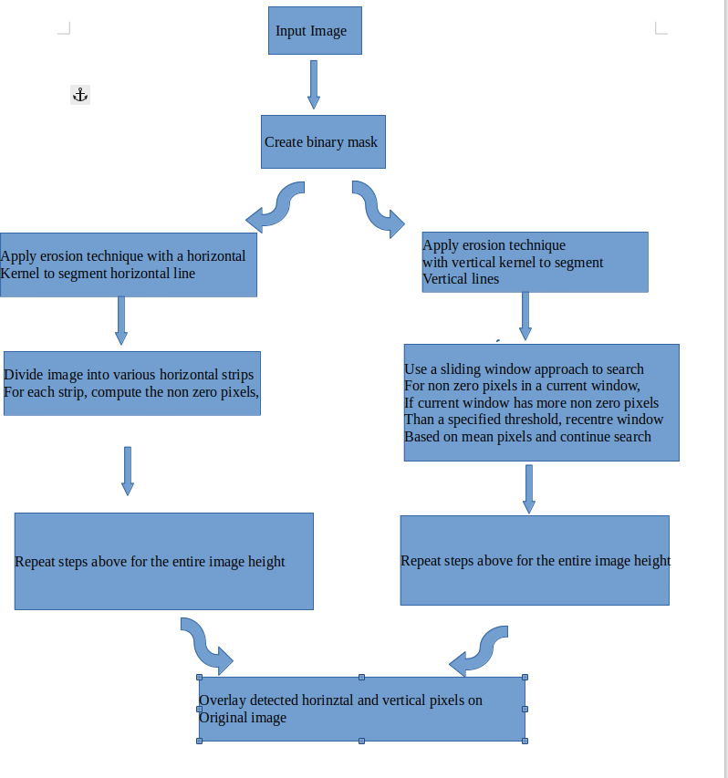
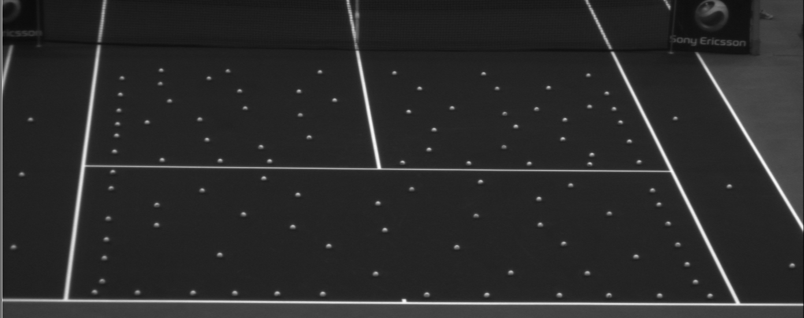
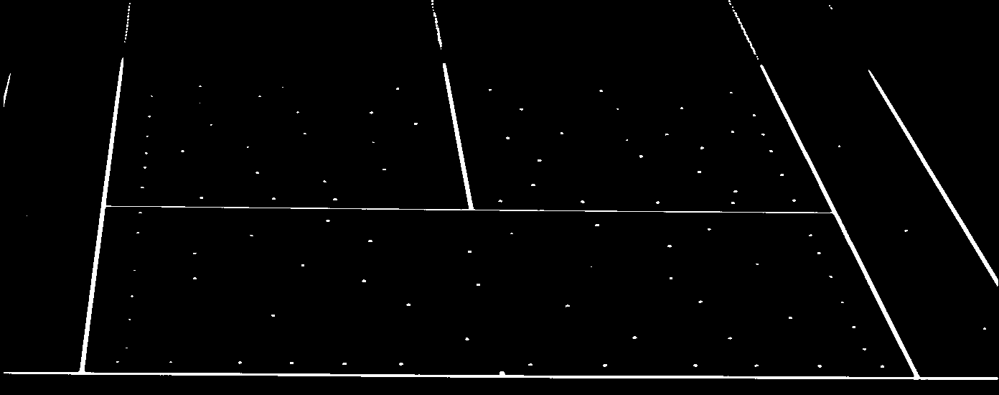
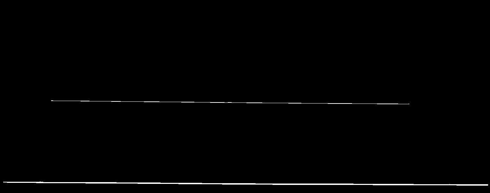
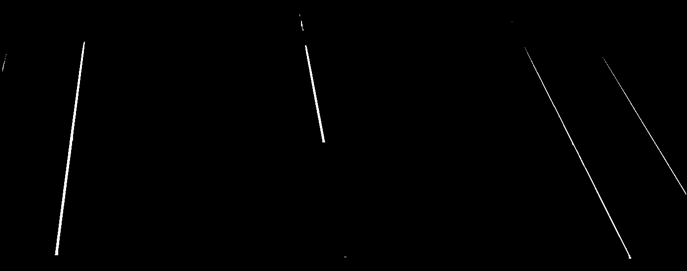
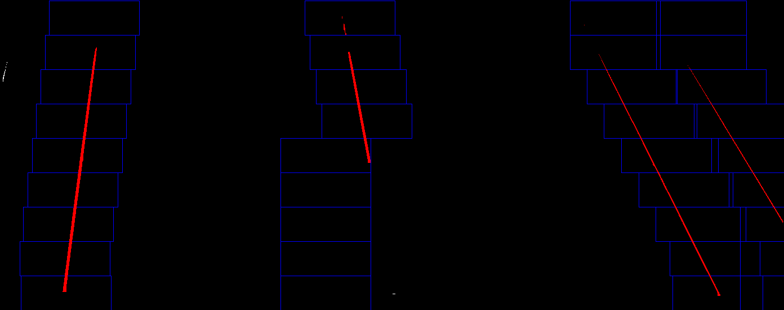
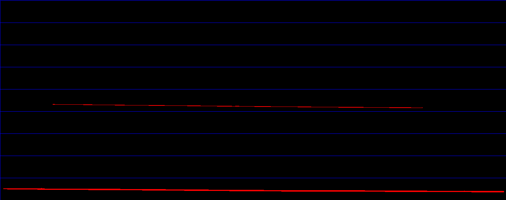
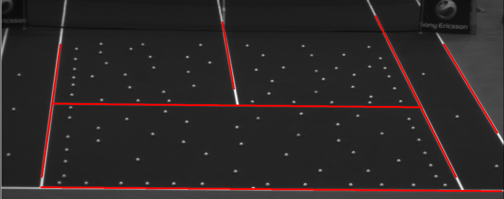

# Line-Detector

## Overview
The objective of this project was to design and develop an algorithm for line detection. 
An image of a tennis court was used as a test case where the aim is to detect the tennis court lines extract them and categorise them.

The following subsection will explain the pipeline of the algorithm step by step
### Algorithm
The pipeline for the proposed algorithm is shown below

* The original input image is shown below:

* The first step would be thresholding the image to obtain a binary mask

* The binary mask above as you can see is noisy, application of erosion techniques with horizontal and vertical kernels is done to segment horizontal and vertical lines

* Horinzontal Lines  

* Vertical Lines

* For vertical line detection, a histogram of the image is calculated and the peaks are identified to figure out starting points for line search. For each window,  identify non zero pixels, if the amount of non zero pixels is greater than a specified threshold recenter the sliding window by the average of pixels in that window

* For horizontal line detection, image is divided into horizontal strips and identify non zero pixels in each strip

* Detected 2d pixel positions for horizontal and vertical lines are overlayed on the original Image

Categorising line types is based on where the lines are positioned on the court. 
Exported output is a CSV file containing the 2d points of the various lines.